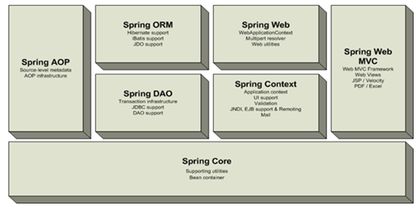

# 1. 스프링 개론
> https://victorydntmd.tistory.com/158?category=698080

## Java Bean
>  재사용가능한 POJO 스펙
- 자바 객체를 **재사용 가능하게 컴포넌트화** 시킬 수 있는 코드 방침 정의 (Java Bean **스펙**)
- Bean = Component = 객체
- POJO with Getter / Setter

## EJB(Enterprise Java Bean)
> service provider
- 기업(Enterprise)들의 개발을 단순화하기 위해 발표한 스펙
- 비즈니스 객체들을 관리하는 컨테이너를 만들어 필요시 마다 컨테이너로부터 객체를 받도록 한다는 개념

    Enterprise JavaBeans are intended to provide encapsulated business logic for enterprise applications within a general container that provided things like session management, security, resource pooling, etc. as services thus allowing the business logic to be (relatively) untainted by these cross-cutting concerns. 

## 스프링 탄생 배경
획기적이었던 EJB 개념으로 인해 J2EE 서버 개발 벤더들은 EJB 스펙을 구현하여 여러 WAS 제품이 출시되었지만 1) **벤더 종속성 발생** 2) EJB 컨테이너를 사용하기 위해 상투적인 코드들 다수 발생 하는 문제들이 생겼다.

스프링 창시자인 로드 존슨은 EJB를 사용하지 않고도 객체간 의존성 해결이 가능한 컨테이너를 개발했는데, 이것이 스프링의 시작이 되었다

**즉 특정 기술에 종속되지 않고( 기술 비침투적 ) 객체를 관리할 수 있는 컨테이너를 제공하는 것이 스프링의 기본 철학이다.**

스프링은 WAS의 기능적인 부분을 유지하되 기술 침투적인 부분을 모두 해결해주며, 따라서 개발자는 비즈니스 로직에 집중할 수 있도록 해주었다.

## 스프링 컨테이너
> EJB Function with POJO

스프링 컨테이너는 특정 클래스를 상속하거나 인터페이스를 구현하지 않는 평범한 자바 클래스(POJO, Plain Old Java Object)를 이용하여 EJB의 기능을 유지하면서 복잡성을 제거하고, 객체들의 라이프 사이클을 관리해준다.

Spring Container는 위의 그림과 같이 다양한 객체들이 모여있는 Bean Factory이다. 

- Spring Container = Bean Factory = IoC Container

## DI & IoC
의존성 주입(DI)란 사용자가 직접 new 키워드를 사용하여 객체를 생성하지 않고, 외부( 컨테이너 )에서 생성된 객체를 주입 받는 방식을 말한다.

그렇기 때문에 사용자가 아닌 외부 컨테이너에서 객체의 생명주기를 관리하는데 이러한 현상을 제어 역전(IoC)라고 한다.
