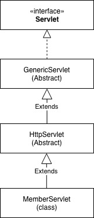
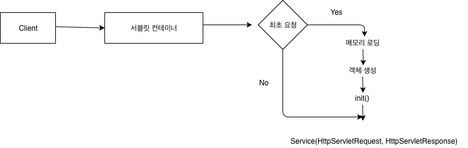
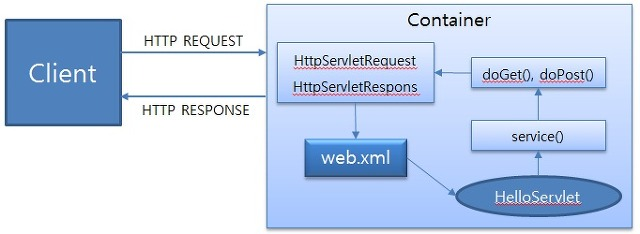
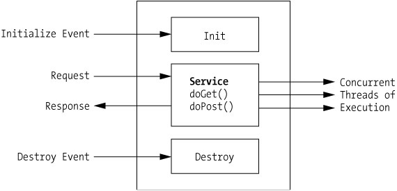

# [3-2] 톰캣 서블릿 동작 과정
> https://minwan1.github.io/2018/11/21/2018-11-21-jsp-springboot-%EB%8F%99%EC%9E%91%EA%B3%BC%EC%A0%95/

## 1. 서블릿 컨테이너
웹서버에서 HTTP 요청을 받아 처리하는 기초 역할을 맡고 있다. 서블릿, 필터, 이벤트 리스너등을 사용자가 적절하게 수정해 서블릿 컨테이너 위에서 동작시킨다.

서블릿 컨테이너는 요청이 들어올 때마다 새로운 자바 스레드를 만든다. 톰켓(was)가 java파일을 컴파일해서 Class로 만들고 메모리에 올려 servlet객체를 만든다.

## 2. 서블릿 구현
먼저 톰캣 즉 서블릿 컨테이너에 의해 프로그램이 실행되기 위해서는 표준 즉 `Servlet interface`를 구현해줘야 한다.사용자 정의 서블릿은 서블릿 컨테이너 내에 등록된 후 서블릿 컨테이너에 의해 생성, 호출, 소멸이 이루어진다.

## 3. 서블릿 구성

### 3.1. Servlet
Servlet은 서블릿 프로그램을 개발할 때 반드시 구현해야 하는 메서드를 선언하고 있는 인터페이스이다. 이 표준을 구현해야 서블릿 컨테이너가 해당 서블릿을 실행할 수 있다.
### 3.2. Generic Servlet
GenericServlet은 Servelet 인터페이스를 상속하여 클라이언트 - 서버 환경에서 서버단의 애플리케이션으로서 필요한 기능을 구현한 추상 클래스이다. service() 메서드를 제외 한 모든 메서드를 재정의하여 적절한 기능으로 구현했다. GenericServlet 클래스를 상속하면 애플리케이션의 프로토콜에 따라 메서드 재정의 구문을 적용해야 한다.
### 3.3. HttpServlet
일반적으로 서블릿이라하면 거의 대부분 HttpServlet을 상속받은 서블릿을 의미한다. HttpServlet은 GenericServlet을 상속받았으며, GenericServlet의 유일한 추상 메서드인 service를 HTTP 프로토콜 요청 메서드에 적합하게 재구현해놨다.

이미 DELETE, GET, HEAD, OPTIONS, POST, PUT, TRAC를 처리하는 메소드가 모두 정의되어 있다. 

사용자 서블릿은 HttpServlet을 상속받아서 필요한 HTTP요청에 대해서 override 시켜주면 된다.

## 4. 서블릿 실행 순서

실행할 서블릿이 최초의 요청인지 판단하고 없으면 해당 서블릿을 새로 생성한다. init() 메소드는 해당 사용자 서블릿이 최초 생성되고 바로 호출되는 메소드이다. service() 메소드는 최초의 요청이든 2번쨰 요청이든 계속 호출되는 메소드이다.

1. 사용자가 URL을 클릭하면 HTTP Request를 Servlet Container에 보낸다.
2. Servlet Container는 HttpServletRequest, HttpServletResponse 두 객체를 생성한다.
3. 사용자가 요청한 URL을 분석하여 어느 서블릿에 대한 요청인지 찾는다.
4. 컨테이너는 서블릿 service() 메소드를 호출하며, POST, GET여부에 따라 doGet() 또는 doPost()가 호출된다.
5. doGet() or doPost() 메소드는 동적인 페이지를 생성한 후 HttpServletResponse객체에 응답을 보낸다.
6. 응답이 완료되면 HttpServletRequest, HttpServletResponse 두 객체를 소멸시킨다.

이때 클라이언트로 url 요청에 대해 서블릿 컨테이너는 올바른 servlet mapping을 가지고 있어야 한다. 이를 톰캣에서는 web.xml 또는 `@ WebServlet`을 사용해 처리하였다. 하지만 위에 방식대로 url마다 모두 매핑해서 사용해야 한다면 유지 보수, 확장성 등을 생각한다면 저러한 방법으로 개발을 계속 해나가는 것은 무모하다. 그래서 여기에서 한 단계 더 진보한 것 MVC 패턴이다. MVC 패턴은 모델(비즈니스로 직), 뷰(화면), Controller(최초 Request를 받는 곳)으로 나누고 개발을 하는 것이다.

