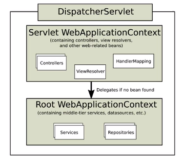
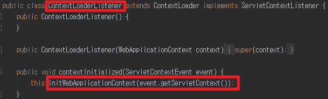

# SpringMVC - Spring MVC 동작원리 - 2
> Servlet에서 IoC Container를 사용하기

> [1. IoC Container](https://galid1.tistory.com/524?category=783055)

> [2. IoC Container 계층 구조](https://galid1.tistory.com/525?category=783055)

기존 ServletWeb Application에서 Spring을 도입한다면 다음과 같은 것을 이용한다는 의미이다.

- Spring 에서 제공하는 IoC Continer를 사용.
- Spring MVC를 사용

**요약**
- **ContextLoaderListener**은 `ServletContext`가 초기화 되는 시점에 `ServletContext`에 `WebApplicationContext.ROOT_WEB_APPLICATION_CONTEXT_ATTRIBUTE`라는 키 값으로 제공받은 `WebApplicationContext`를 담도록 요청해주는 역할을 하는것을 알 수 있습니다.

- `ContextLoader`는 실질적으로 IoC Container를 생성하고 ServletContext에 담는 역할을 합니다.

- Tomcat Servlet
  1. Root webApplication Context(= Servlet Context = Application Context)
     - ContextLoaderListener에 의해 ServletContext에 등록되는 ApplicationContext로 모든 Servlet이 사용가능합니다.
  2. Servlet Context Listener
- Spring Container
  1. Servlet Context안에 `WebApplicationContext` 생성
     - DispatcherServlet에서 Root WebApplicationContext를 상속받아 만든 ApplicationContext 으로 해당 DispathcerServlet 안에서만 사용이 가능합니다.
  2. `ContextLoaderListener` implements `Servlet Context Listener`




## web.xml
```xml
<!-- 톰캣 서블릿 context로 부터 받는 parma1: ApplicationContext Class Type-->
  <context-param>
    <param-name>contextClass</param-name>
    <param-value>org.springframework.web.context.support.AnnotationConfigWebApplicationContext</param-value>
  </context-param>
  <!-- 톰캣 서블릿 context로 부터 받는 parma2: Configuration 파일-->
  <context-param>
    <param-name>contextConfigLocation</param-name>
    <param-value>minkj1992.com.AppConfig</param-value>
  </context-param>
  

  <listener>
    <listener-class>org.springframework.web.context.ContextLoaderListener</listener-class>
  </listener>
```

`ContextLoaderListener`

ContextLoaderListener는 ServletContext의 라이프사이클에 맞추어 ApplicationContext를 ServletContext에 추가/삭제 하도록 합니다.

 

`ContextLoader`

ContextLoaderListener가 상속받을 Class로 실질적으로 ApplicationContext를 생성하고 ServletContext에 setting하는 역할을 합니다. `ContextLoader`가 ApplicationContext를 ServletContext에 등록하기 위해서는 1) `ApplicationContext Class Type`과 2)`ApplicationConetxt Configuration 파일`이 필요합니다. 그러한 1)Class Type과 2)Configuration 파일을 ServletContext의 Parameter로부터 전달받게 되는데 그것들이 바로 아래의 두개의 태그들입니다.(contextClass, contextConfigLocation)

 

`contextClass`

contextClass의 경우 ContextLoader에서 생성할 IoC Container 클래스를 받아들일 Parameter Name을 의미합니다. 우리는 Annotation을 기반으로 Bean을 등록할 것이므로 Annotation을 인식할 수 있는 AnnotationConfigWebApplicationContext를 등록해주었습니다.

 

`contextConfigLocation`

contextConfigLocation은 말그대로 IoC Continaer의 설정 파일의 위치를 의미합니다. xml의 위치를 입력할 수도있고 개발자가 정의한 Java Class 파일을 입력할 수도 있습니다.


