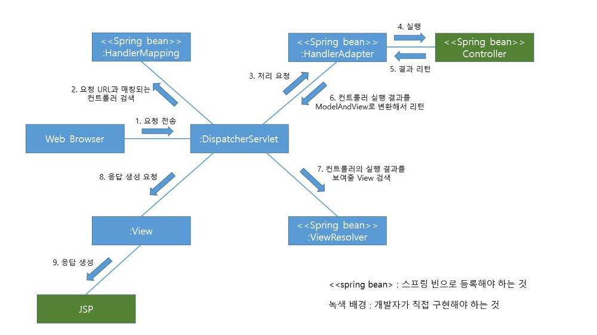

# DispatcherServlet flow
> [DispatcherServlet flow](https://joont92.github.io/spring/DispatcherServlet-Flow/)

> [MVC 프레임워크 동작방식](https://tinkerbellbass.tistory.com/40)

> [@RequestMapping](https://joont92.github.io/spring/@RequestMapping/)

**목표: Tomcat Container 이후 DispatcherServlet의 동작과정을 확인한다.**

<!-- TOC -->

- [DispatcherServlet flow](#dispatcherservlet-flow)
  - [1. URL 요청](#1-url-요청)
  - [2. `DispatcherServlet` Strategy 선택](#2-dispatcherservlet-strategy-선택)
  - [3. HandlerMapping](#3-handlermapping)
  - [4. HandlerAdapter](#4-handleradapter)
  - [5. Controller](#5-controller)
  - [6. ViewResolver](#6-viewresolver)
  - [7. View](#7-view)
  - [8. HTTP Response](#8-http-response)

<!-- /TOC -->

## 1. URL 요청
Client로 부터 URL 요청이 들어오게 되면 `DispatcherServlet`에게 권한이 위임된다.

## 2. `DispatcherServlet` Strategy 선택
권한을 위임받은 `DispatcherServlet` 다양한 전략을 사용하여 해당 요청들에 대해 response 한다. 최초로 `DispatcherServlet.properties`에 들어있는 설정을 통해서 전략(이때 전략들 또한 `bean`으로 관리된다.)을 초기화하며, 내부적으로 가진 `어플리케이션 컨텍스트`를 통해 확장 가능한 전략이 있는지 찾은 뒤, 해당 전략들을 모아 역활을 수행한다.

이때 전략은 MVC Flow 큰 흐름을 담당하는 요소들 마다 각각 선택되어지고 관리된다.

1. `HandlerMapping`
2. `HandlerAdapter`
3. `HandlerExceptionResolver`
4. `ViewResolver`
5. `LocaleResolver`
6. `RequestViewNameTranslator`

## 3. HandlerMapping
> 요청을 처리할 Controller를 가리키는 Handler를 반환

`DispatcherServlet`은 가장 먼저 `HandlerMapping`의 전략으로 취한 전략 bean들에게 HTTP 요청정보를 담고있는 `HttpServletRequest`을 전달하여 Object타입의 `Handler`를 return 받는다.

## 4. HandlerAdapter
> HandlerMapping을 통해 찾은 컨트롤러를 직접 실행하는 기능을 수행한다.

핸들러 어댑터는 HandlerAdapter 인터페이스를 구현해서 생성한다. 전달받은 Handler를 기준으로 Controller단에서 호출해야할 method를 찾고, Controller를 호출한다. 이후 값을 전달받아 DispatcherServlet에게 `ModelAndView` 형태로 전달한다.

이때 `Interceptor`, `HandlerExceptionResolver`등이 요청된 타이밍과 조건에 따라 실행된다.

## 5. Controller
컨트롤러는 사용자 요청을 해석하여 비즈니스 로직을 수행하고 결과를 받아온 뒤, `Model`에 넣는다. 이때 `Model`은 `View`에 뿌려줄 정보를 담은 key, value 형태의 `맵`이다.

모델이 준비되었으므로 뷰를 선택한다. 뷰 오브젝트를 직접 선택할 수도 있지만 보통은 뷰 리졸버를 사용므로 뷰의 논리적인 이름만을 `ModelAndView`형태로 `DispatcherServlet`에게 리턴한다. 

`DispatcherServlet`은 이를 `ViewResolver`에게 전달한다.

## 6. ViewResolver
`Controller`단에서`모델`과 이에 대한 `View name`이 결정되었다면, `ViewResolver`에서는 `View name`에 매칭되는 실제 `View Object`를 `DispatcherServlet`에게 리턴한다.

## 7. View
`DispatcherServlet`은 `뷰 오브젝트`가 필요로 하는 `모델`을 넘겨주며 최종 결과물을 생성해달라고 요청한다. 생성된 최종 결과물은 `HttpServletResponse 오브젝트`에 담겨

## 8. HTTP Response
DispatcherServlet은 공통적으로 진행해야 할 후처리 작업이 있는지 확인하고 이를 수행한다.
수행이 끝나면 HttpServletResponse에 담긴 최종 결과를 서블릿 컨테이너에게 돌려주며, 내장 Tomcat 컨테이너는 이를 Client로 전달한다.